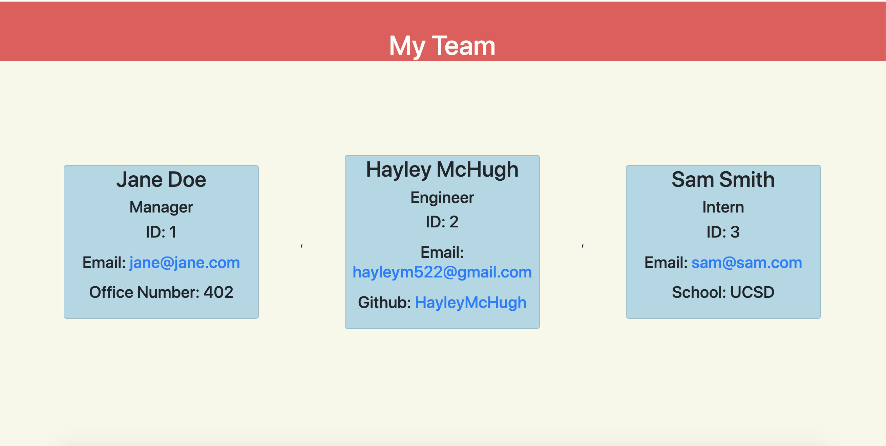

# Team-Profile-Generator

## Description
A node application that generates a team profile from the command line.

## Table of Contents
[Installation](#installation)

[Usage](#usage)

[Credits](#credits)

[License](#license)

[Tests](#tests)

[Questions](#questions)

## Installation
To install, download the repository and run 'node index.js' in the command line.

## Usage
Once you run 'node index.js', you will be asked a series of questions about your team. After you answer all the questions, an HTML file will be created from your answers and will be in the 'dist' folder. Here is a video demonstrating how to use the application. <a href="https://watch.screencastify.com/v/IYcGPJxKLV4mzg8W4eDy">Demo</a>

Sample HTML file: file:///Users/hayleymchugh/ucsdbootcamp/homeworks/team-profile-generator/dist/index.html 
(copy and paste in browser)

## Credits
n/a

## License
Licensed under Unlicense.

## Tests
You can run tests in the command line by running 'npm run test Employee(Manager, Engineer, Intern)'.

## Questions
If you have any questions at all, below are links to my github as well as my email address. Feel free to contact me!

<a href="https://github.com/HayleyMcHugh">Github</a>

<a href="mailto:hayleym522@gmail.com">Email</a> 